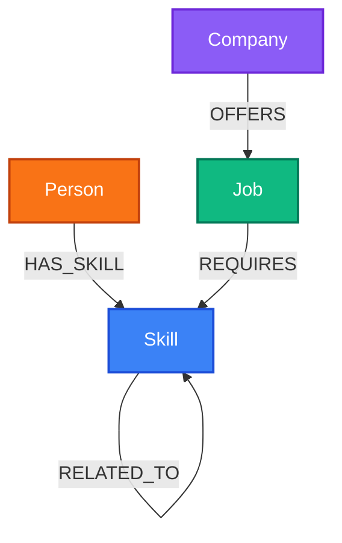

# CareerGraph

## Overview
CareerGraph is a graph-based career exploration platform that connects People to Skills, Jobs, Companies, and Projects. It allows users to explore job requirements, understand skill relationships, identify missing skills (skill gap), and visually discover career paths using a graph database.

## Features
- **Job Explorer**: Search for jobs, filter by level, view required skills and the companies offering them.
- **Skill Explorer**: Select a skill to see related skills and the jobs that require it.
- **Skill Gap Analysis**: Compare a user profile's existing skills against the required skills for a target job.
- **Job Recommendations**: Get AI-powered job recommendations based on your current skills and multi-hop graph relationships.
- **Graph Explorer**: Visually traverse the entire career graph using React Flow. See how technologies connect to jobs and companies.

## Why a Graph Database?

For a career discovery and skill gap analysis system, entities are deeply interconnected:
- **Users** have multiple **Skills**.
- **Jobs** require multiple **Skills** and are offered by **Companies**.
- **Skills** relate to other **Skills** (e.g., React -> JavaScript).

### Why Graph (openCypher / CognoDB) over Relational (SQL):
1. **Multi-Hop Traversal Performance:** Finding "Jobs I match based on my skills" or "Missing skills for my target role" requires traversing `User -> Skill -> Job -> Missing Skill`. In SQL, this involves complex multi-table `JOIN` operations that degrade as data grows. In Cypher, path matching (`(u:User)-[:HAS_SKILL]->(:Skill)<-[:REQUIRES]-(j:Job)`) executes in constant time relative to the subgraph size.
2. **Flexible Schema Adaptation:** New relationship types (e.g., `APPLIED_TO`, `RECOMMENDED_BY`, `INTERESTED_IN`) can be added without alter-table migrations or breaking existing schemas.
3. **Graph Explorer & Analytics:** Visualizing network relationships directly map to real-world domain mental models, making interactive exploration far more intuitive.

## Architecture
The application uses a 3-layer architecture:
1. **Frontend**: React, Vite, Tailwind CSS, React Flow, React Router
2. **Backend**: Node.js, Express, Neo4j JavaScript Driver
3. **Database**: CognoDB / Neo4j AuraDB

## Data Model



- **Person** (`id`, `name`, `email`)
- **Skill** (`id`, `name`, `category`)
- **Job** (`id`, `title`, `level`, `description`)
- **Company** (`id`, `name`, `industry`, `location`)

## Graph Schema
- `(Person)-[:HAS_SKILL]->(Skill)`
- `(Skill)-[:RELATED_TO]->(Skill)`
- `(Job)-[:REQUIRES]->(Skill)`
- `(Company)-[:OFFERS]->(Job)`

## Main Cypher Queries

### Multi-hop traversal (Recommendations)
Finds jobs reachable through skills related to the user's existing skills, up to two relationship levels away.
```cypher
MATCH (p:Person {id: $personId})
      -[:HAS_SKILL]->(s1:Skill)
      -[:RELATED_TO*0..2]->(s2:Skill)
      <-[:REQUIRES]-(j:Job)
RETURN DISTINCT j.id AS jobId, j.title AS jobTitle, j.level AS jobLevel, count(DISTINCT s2) as overlapScore
ORDER BY overlapScore DESC LIMIT 10
```

### Skill-gap query
Finds skills required by a target job that the user does not currently possess.
```cypher
MATCH (j:Job {id: $jobId})-[:REQUIRES]->(s:Skill)
WHERE NOT EXISTS {
  MATCH (:Person {id: $personId})-[:HAS_SKILL]->(s)
}
RETURN s
```

### Job recommendation query
*(Covered by the Multi-hop traversal above)*

## Tech Stack
- Frontend: React, Vite, Tailwind, React Flow
- Backend: Node.js, Express, Neo4j-Driver
- Database: CognoDB (Neo4j)

## Project Structure
```text
├── backend/
│   ├── config/          # Neo4j Driver Connection
│   ├── controllers/     # Express route handlers
│   ├── middleware/      # Global error handlers
│   ├── routes/          # Express routing logic
│   ├── scripts/         # Database seeding (seed.js)
│   ├── services/        # Cypher queries via neo4j-driver
│   └── server.js        # Entry point
│
└── frontend/
    ├── src/
    │   ├── components/  # Layout, Sidebar
    │   ├── lib/         # API (Axios) connection
    │   ├── pages/       # Dashboard, Jobs, Skills, Profile, GraphExplorer
    │   └── App.jsx      # React Router Setup
    ├── tailwind.config.js
    └── vite.config.js
```

## Local Setup

### 1. Clone repository
```bash
git clone <your-repo>
cd Wexa
```

### 2. Create CognoDB instance
Create a free Neo4j AuraDB or CognoDB instance online. Note your connection URI, Username, and Password.

### 3. Configure environment variables
In the `backend` folder, copy `.env.example` to `.env` and fill in your database credentials:
```env
COGNODB_URI=bolt+s://your-instance.databases.neo4j.io
COGNODB_USERNAME=neo4j
COGNODB_PASSWORD=your_password
PORT=5000
```

### 4. Install dependencies
```bash
# Terminal 1 - Backend
cd backend
npm install

# Terminal 2 - Frontend
cd frontend
npm install
```

### 5. Seed database
Populates your graph database with mock skills, jobs, companies, and people.
```bash
cd backend
npm run seed
```

### 6. Start backend
```bash
cd backend
npm run dev
```
Runs on `http://localhost:5000`.

### 7. Start frontend
```bash
cd frontend
npm run dev
```
Runs on `http://localhost:5173`.

## Deployment
- Frontend is configured to be deployed easily to Vercel (just connect the repository and set the root directory to `frontend`).
- Backend can be deployed to Render or Heroku. Make sure to set the environment variables in your hosting provider's dashboard.

## Screenshots


## Demo
[https://wexaai.netlify.app/](https://wexaai.netlify.app/)

## Screen Recording
[Watch Demo Video](https://drive.google.com/file/d/1-xp9UWUSqSCgBWiBbsKdtAZG_rRIcsSE/view?usp=sharing)

## Future Improvements
- Add authentication (JWT) to manage real user profiles.
- Integrate LLMs to auto-generate personalized career path suggestions based on graph data.
- Enhance the GraphExplorer with drag-and-drop node editing.

